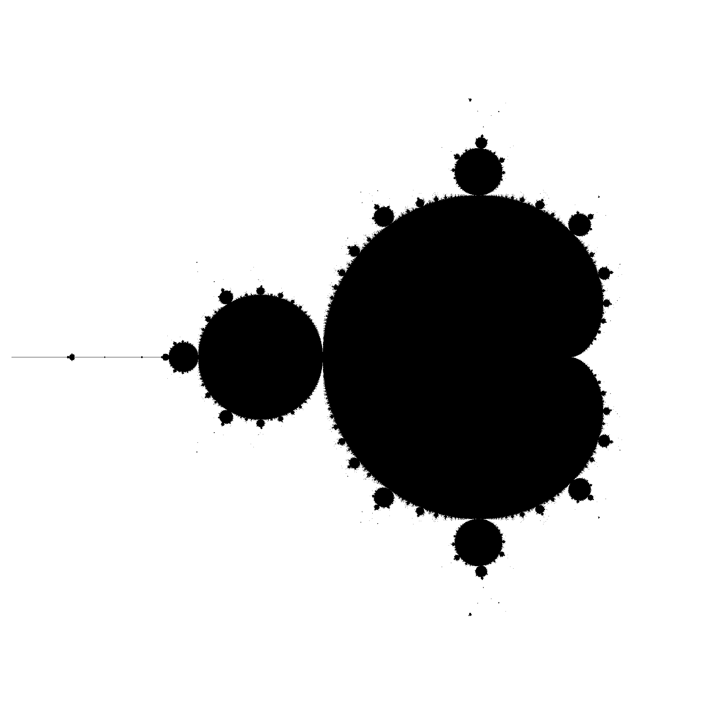
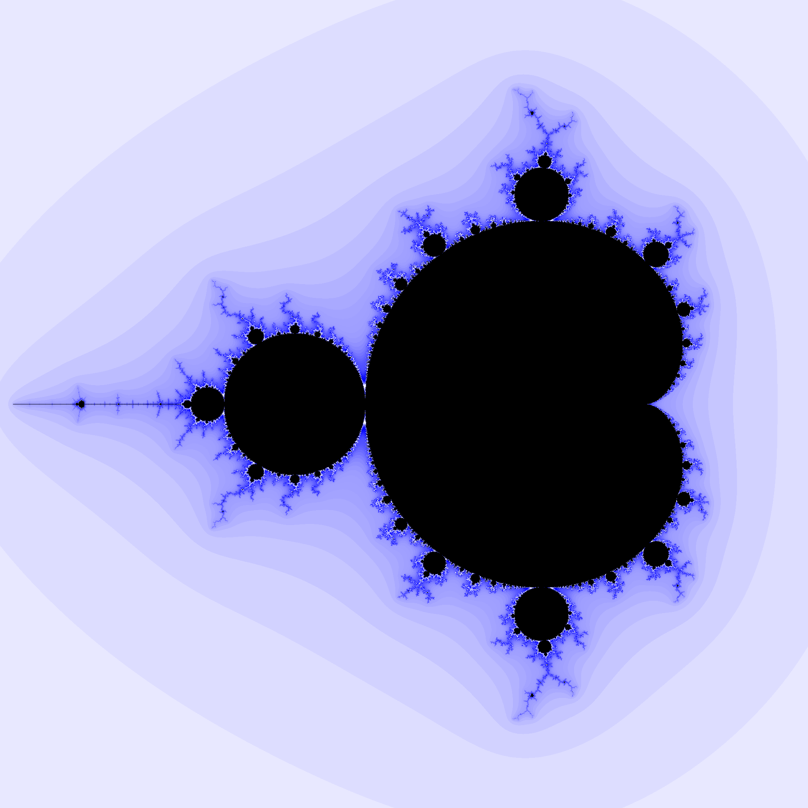
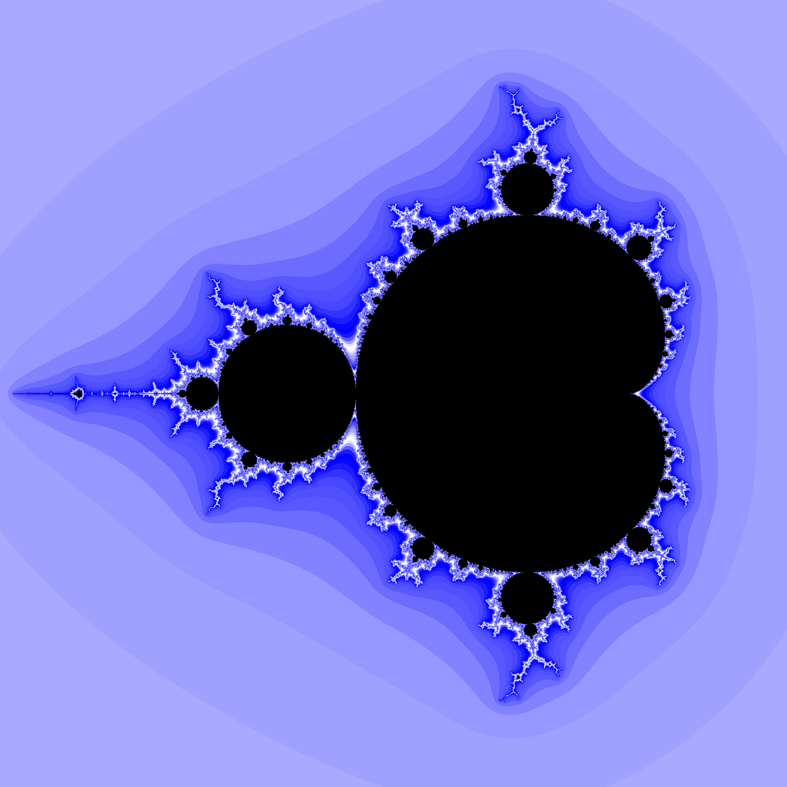
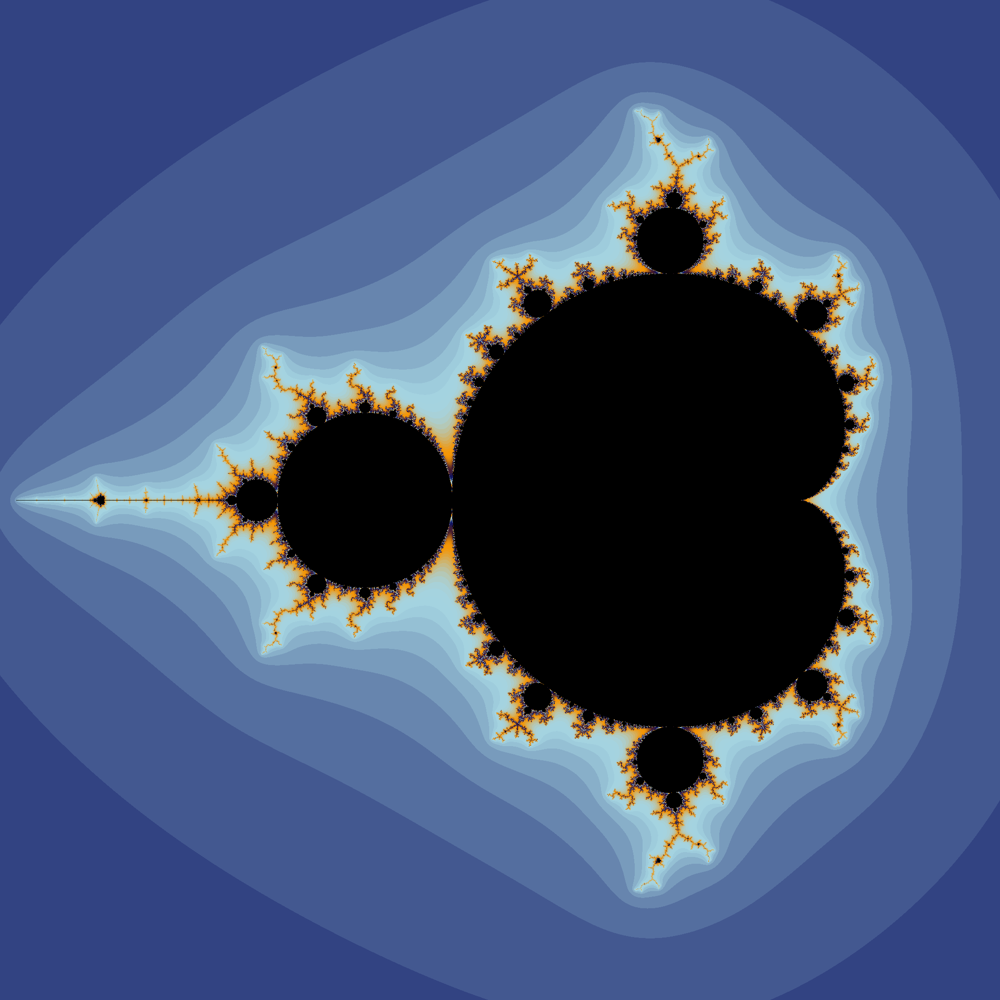
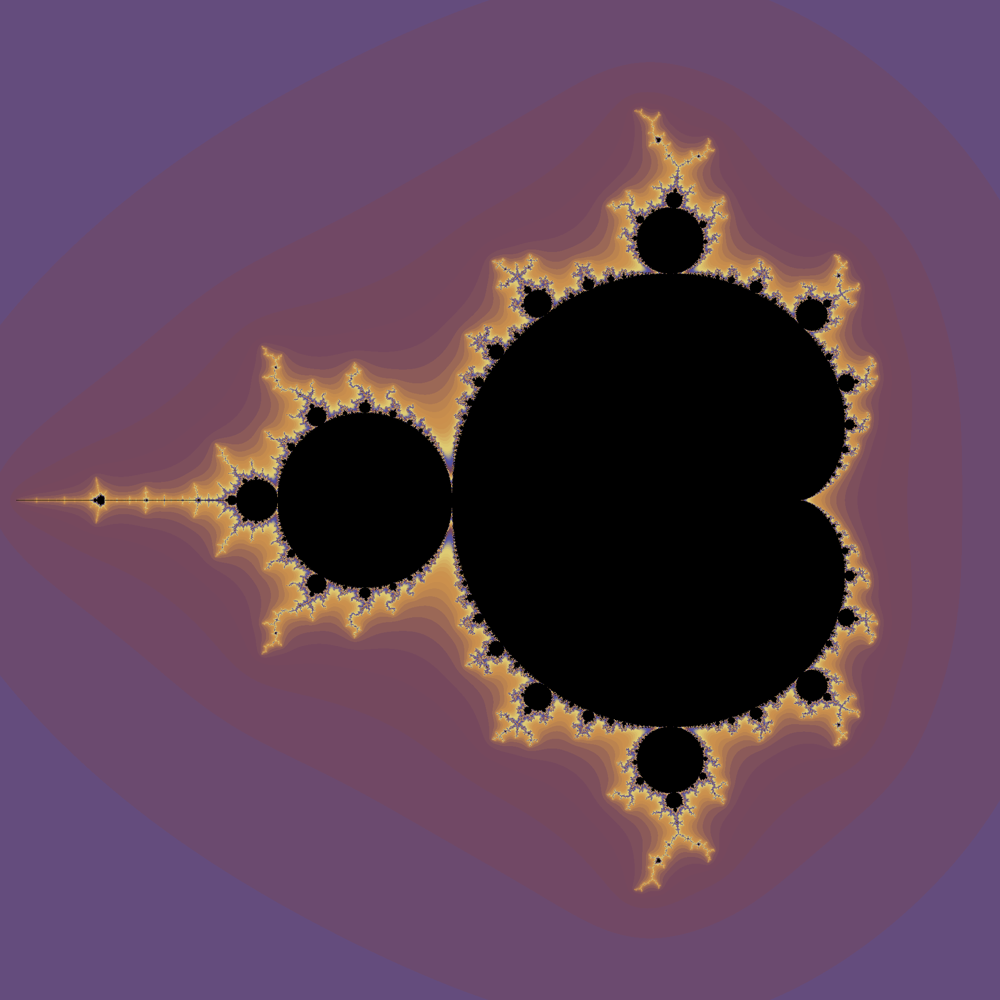
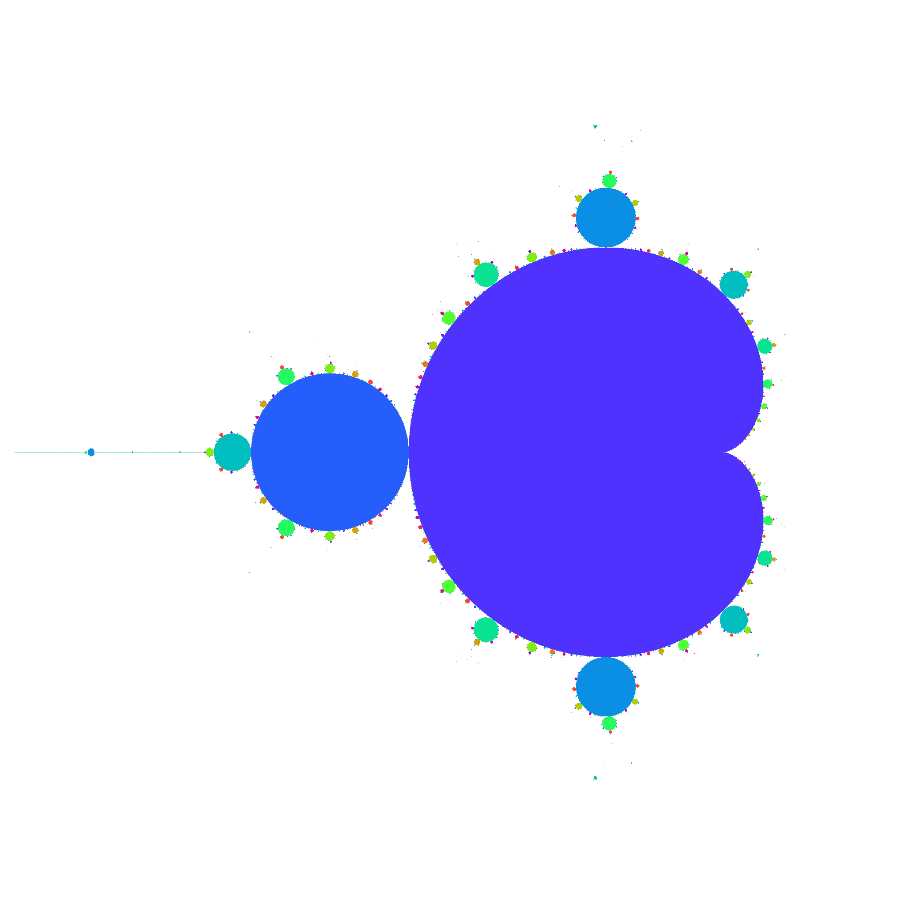
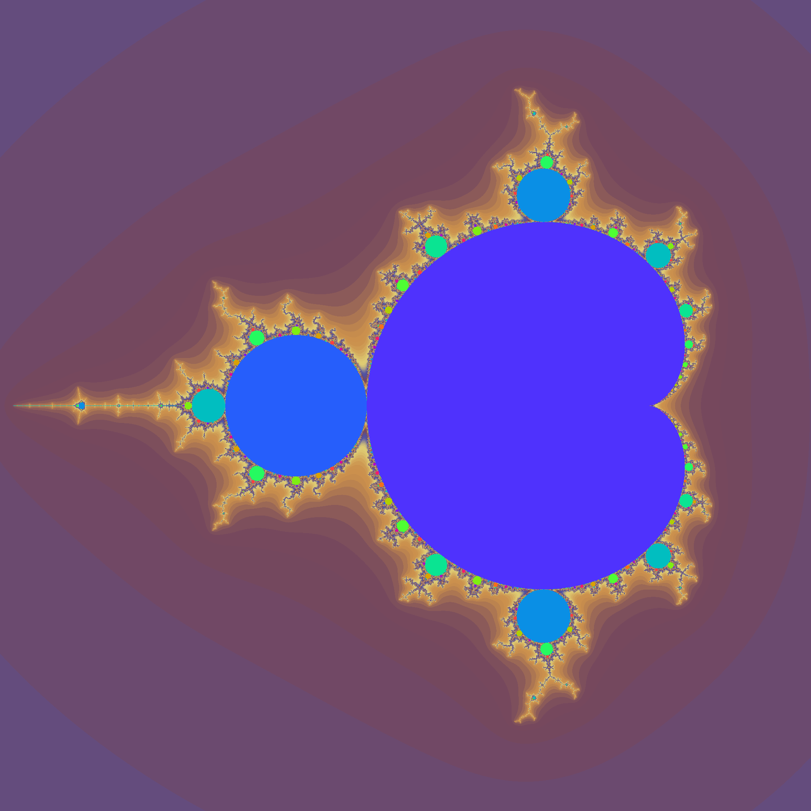

### The most basic way to color fractals is to color each point in the fractal black and each point outside the fractal white. 

### Points which are colored white eventually reach the bailout radius, but how fast they reach that radius varies greatly. We can color each point by putting the number of iterations needed to reach the radius into a gradient. In the image below points are colored on a white->blue scale.

### In the above photo, you may notice that the points mostly get more blue as they approach the boundary of the fractal, but there are some white points right next to it. This is because any gradient is limited, a point can only get so blue. Due to this limitation, we take the number of iterations needed to reach the bailout radius modulo some number that we call the coloring density. The above picture has a coloring density of 50. Here is the same fractal but generated with a coloring density of 20. The colors are less smooth, and they cycle back to white faster.

### We can do better than a basic gradient from one color to another. We want to cycle between 4 colors in a smooth way. Instead of doing a linear gradient between each color, the colors were interpolated using a cubic spline. The details of this aren't very important, but in essence it makes a smooth transfer between the colors. For those who are curious, it is a cubic spline with the additional restriction that the derivative at each knot is zero. 

### Several preset gradients can be found in [palettes.py](palettes.py). Here is the mandelbrot set generated with the 'classic' and 'event_horizon' palettes.

### The points inside the mandelbrot set must stay fixed, or fall into some sort of cycle. The order of the cycle it falls into (how many iterations it takes to return to the start) can also be put in a gradient. Coloring like this shows something very interesting, each bulb of the mandelbrot set contains points which fall into cycles of the same order. 

### Finally, these two methods of coloring can be combined.

