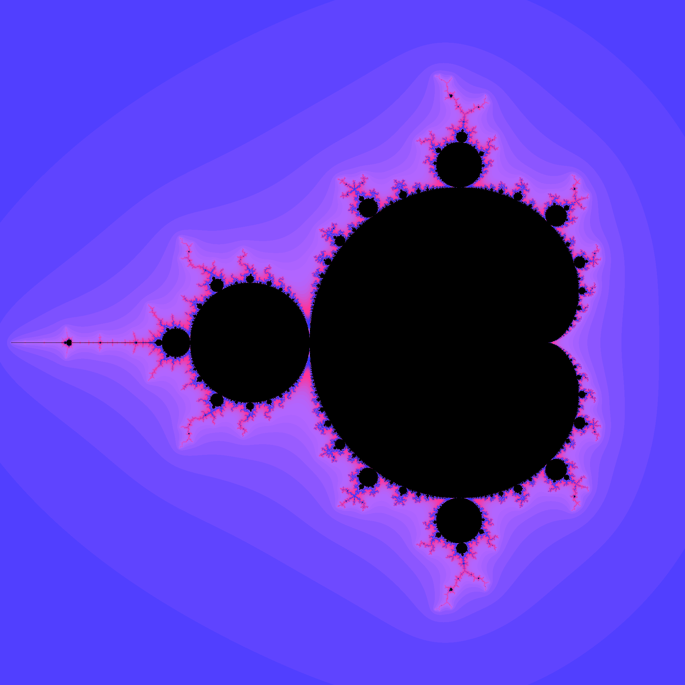
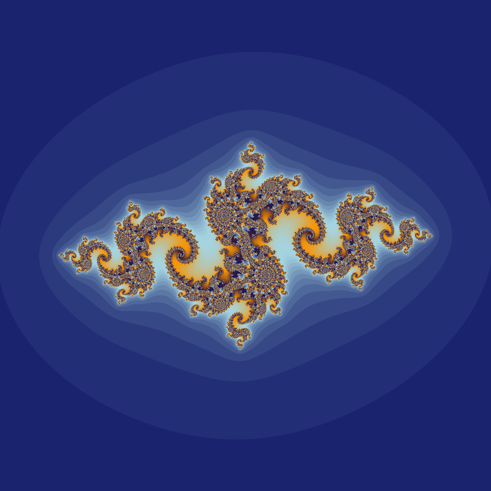
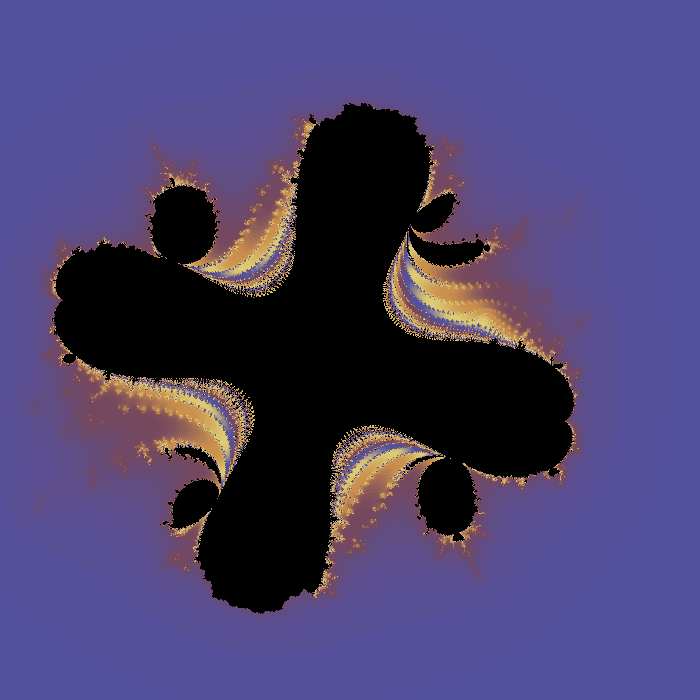
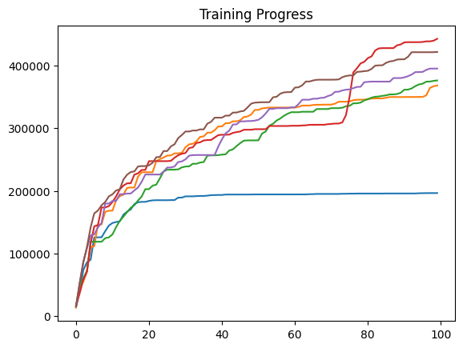
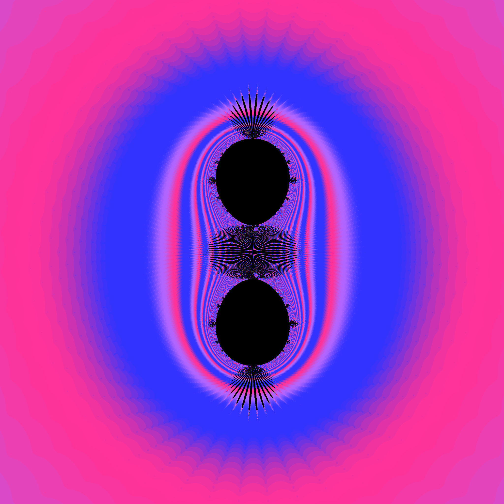

## Overview

This project explores how high-performance computing and global optimization algorithms can be used to automatically discover visually interesting fractals. By combining GPU-acceleration with particle swarm optimization, my code has sifted through millions of possible functions to find those that generate rich, self-similar structures.

You may have seen pictures like this:

Or this:

These are images of fractals on the complex plane, stunning images created purely through math. But how do we generate these images? And can we make them better? 

My code deems a fractal interesting if it has a large surface area, the idea being that a shape with more surface area must be rougher and have more folds. The image below shows the current peak of my findings. To see more images like this, check out [the gallery](gallery). 

## Fractal Generation

### The math behind the images

While these images may look extremely complicated, they were all generated by relatively small polynomials. Each of these images shows a subset of the complex plane containing points that don't 'blow up' under some function. Let's dive into the most iconic example, the mandelbrot set. Take some complex number $c \in \mathbb{C}$, how can we determine if c is in the mandelbrot set? First, set $z=0$, then repeatedly apply the following transformation: $z = z^2+c$. If z stays small, no matter how many times the transformation is applied, then c is in the mandelbrot set. We generate the picture below by coloring all points in the mandelbrot set black and all points outside of the set white. For a more in-depth study of fractals (and some stunning images), check out (Junpei Sekino's fractal gallery)[https://www.sekinoworld.com/fractal/#fig3.3]

### Coloring

We can spice up the image by coloring pixels outside of the set based on how quickly they blow up. When actually generating the fractal, you need to specify some *bailout radius* for the program. No computer program can definitively say whether or not $z$ will blow up (except in special cases). Instead, after each iteration it checks how far $z$ is from the origin, if it is farther away than the bailout radius then we can confidently say that $z$ will blow up. Based on the number of iterations it takes for $z$ to reach the bailout radius, we color the point. In the picture below we color all points outside the set with a simple blue to white gradient. Generating good looking color gradients can be complicated, so the details of this are in [COLORING.md](COLORING.md).

### New fractals

The choice of the function $z^2+c$ is arbitrary, so why not choose functions that generate something more interesting? This project uses functions of the form $\sum a_{i,j,k} \cdot c^{i} \cdot z^{j} \cdot \bar{z}^{k}$ where each $a_{i,j,k}$ is a constant and $i$, $j$, and $k$ are 0, 1 or 2 (they cannot all be zero). Choosing good values of $a_{i,j,k}$ is the entire purpose of this project.

## Optimizing Fractals

### What are we optimizing?

Trying to quantify how 'cool' a fractal is very subjective, but to start we will be using the surface area of the result. This should produce more complicated shapes. We cannot actually find the surface area of a fractal, but we can approximate it by generating the fractal at a certain resolution and finding the surface area of that.

### Particle Swarm Optimization

My first thought for an optimization method was gradient descent. However, there are too many local optima for this approach to be feasible, so a different algorithm was needed. The particle swarm optimization was chosen to find global optima. PSO is simple, cares very little about the structure of the function it is optimizing, and is relatively fast. PSO uses a large cloud of input parameters to get a more large picture view of the function being optimized. My implementation  and explanation of PSO is in [PSO.ipynb](PSO.ipynb). You can also read more on how PSO works [here](https://www.geeksforgeeks.org/machine-learning/particle-swarm-optimization-pso-an-overview/). 

## Results

### Initial optimization

At first, every coefficient was using PSO. The initial results were underwhelming: although the generated shapes were complex, they lacked symmetry and recognizable fractal structure.

PSO Hyperparameters

- Population size: 30 particles
- Training length: 1000 epochs
- Evaluation resolution: 2048 × 2048
- Runs: 6
- w: 0.8
- c1: 2.0
- c2: 0.8

Optimization results:

Best fractal found:

### Symmetrical fractals

In an attempt to make the fractals more visually appealing, I set all of the imaginary components of the coefficients to zero. This gave my fractals more structure and made them symmetrical over the x-axis. Also, to my surprise, it created fractals with far larger surface areas that also looked better. This inspired me to play around with optimizing different sets of parameters.

Optimization results:

Best result found:

### Other parameter sets

The z conjugates also made the resulting fractal more complicated. I am convinced that it is what allowed the fractals to have holes because it made the iteration functions nonanalytic. So what happens if we remove all of them? The surface area of the fractals takes a hit, but is still better than using every parameter. The fractals also look better and have the self similarity we were looking for.

We can also use only real parameters without conjugates. This lowered the results again, and made a very interesting fractal. It has these 'pseudo-bulbs' that are shaped like the usual bulbs found in fractals, but are made up of many small filaments.

## Code Optimization

### Running code on the GPU

Generating high quality fractals can be very computationally expensive, but it maps extremely well to GPU architectures. Each pixel can be computed in parallel, giving massive speedups. There are multiple libraries that can be used to run code on the GPU, but OpenCL was chosen for its portability and relative simplicity. Having OpenCL correctly set up is the main barrier to running the code in this repo, and can be tricky to set up. The actual code run on the GPU can be found in [optimized_fractals_dll\src\kernels](optimized_fractals_dll\src\kernels).

### Iterating the smart way

How exactly you iterate can give a massive speedup as well. The code in [fractal_calculations.ipynb](fractal_calculations.ipynb) converts expressions to a form which minimizes multiplications (essentially [Horners Method](https://en.wikipedia.org/wiki/Horner%27s_method)), and then uses common subexpression elimination and constant folding to speed up calculations. This optimization makes the kernel code run more than 20 times faster. A demonstration of this is in [equation_speed_test.py](tests/equation_speed_test.py) and [equation_speed_test.c](tests/equation_speed_test.c).

### What resolution, how many iterations?

When generating fractals, we choose a number of iterations to run before we decide how to color a pixel. The speed of our program is roughly linear with respect to the number of iterations chosen, so we want to choose a small amount of iterations without sacrificing the quality of the result. Tests showed a linear relation between the resolution of the fractal and the number of iterations needed to ensure a certain level of quality. Look at [iteration_counts.ipynb](iteration_counts.ipynb) for details. 

