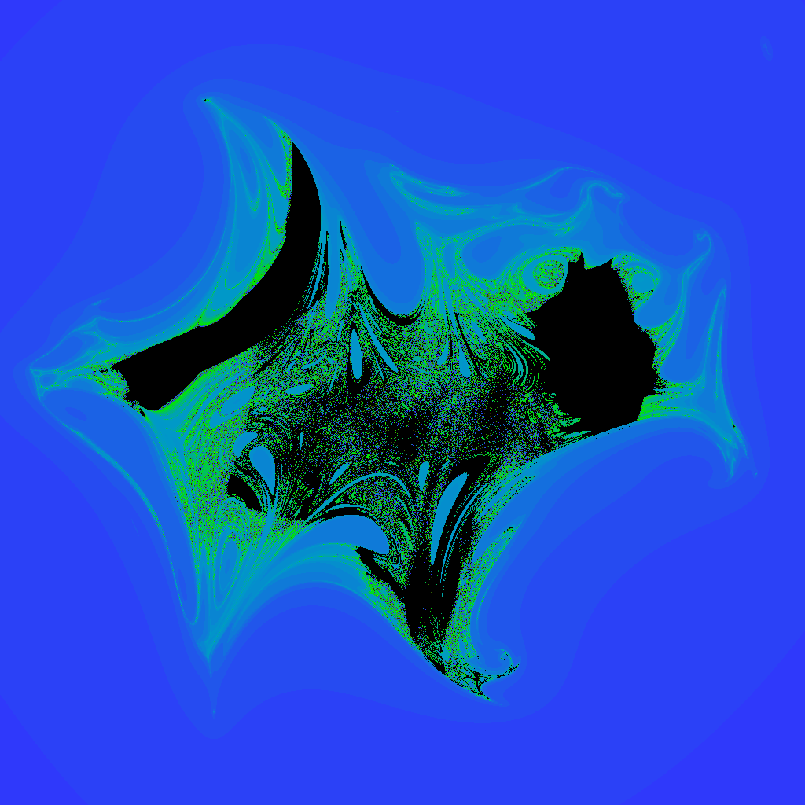
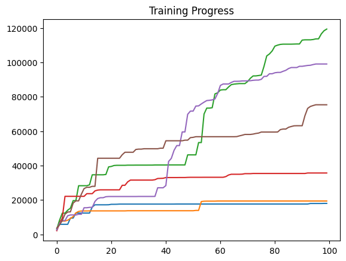
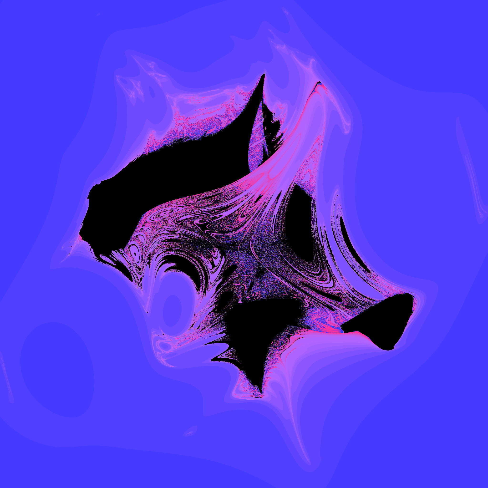
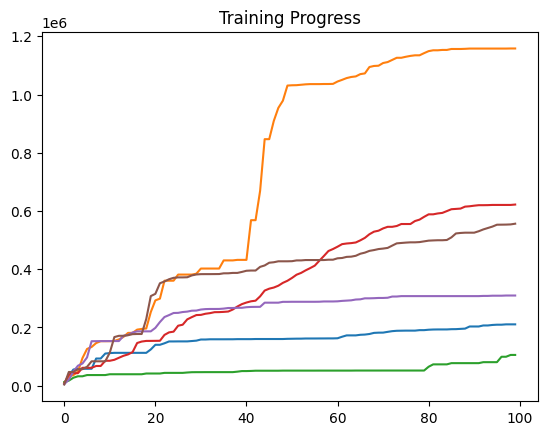
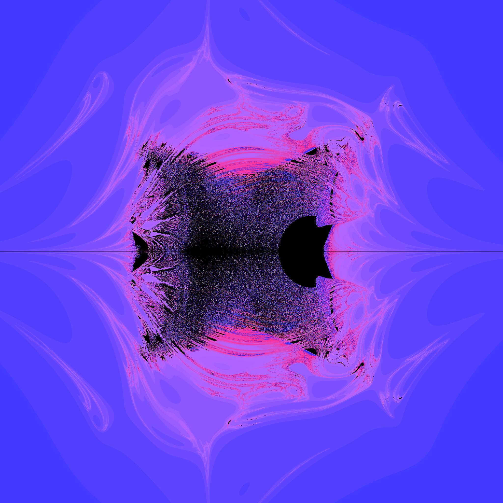
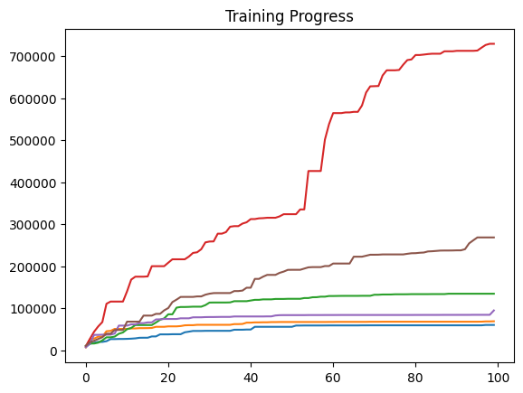
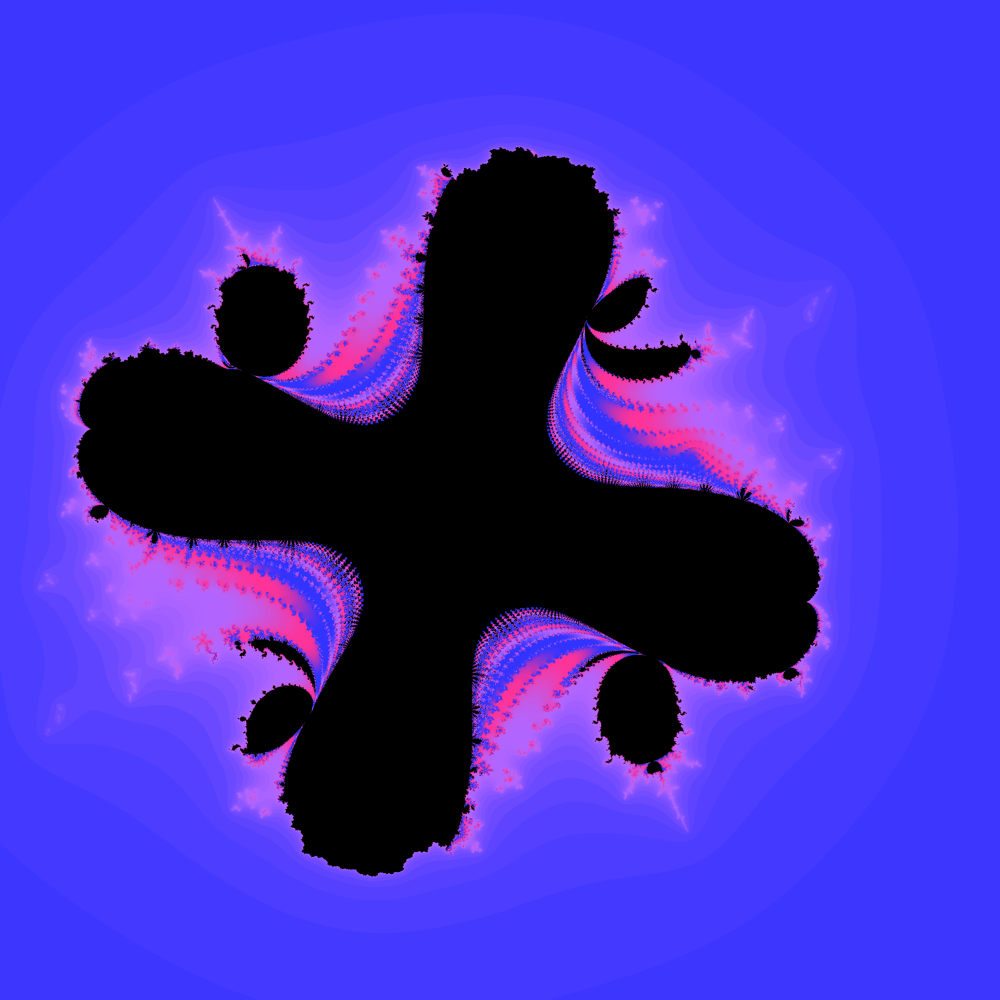

## Overview

You may have seen images like this:

TODO ADD IMAGE

Or this:

TODO ADD IMAGE 

These are images of fractals on the complex plane, stunning images created purely through math. But how do we generate these images? And can we make them better? 

In this repo I make a framework for quickly generating fractals utilizing the GPU. Then I use particle swarm optimization to find the 'coolest' fractals. There is still a lot of progress to be made, but here is the current peak of my findings.

## Fractal Generation

### The math behind the images

While these images may look extremely complicated, they were all generated by relatively small polynomials. Each of these images shows a subset of the complex plane containing points that don't 'blow up' when a certain function is repeatedly applied. Lets dive into the most iconic example, the mandelbrot set. Take some complex number $c \in \mathbb{C}$, how can we determine if c is in the mandelbrot set? First, set $z=0$, then repeatedly apply the following transformation: $z = z^2+c$. If z stays small, no matter how many times the transformation is applied, then c is in hte mnadelbrot set. We generate the picture below by coloring all points in the mandelbrot set black and all points outside of the set white. For a more in-depth study of fractals (and some stunning images), check out (Junpei Sekino's fractal gallery)[https://www.sekinoworld.com/fractal/#fig3.3]

TODO PUT MANDELBROT IMAGE

### Coloring

We can spice up the image by coloring pixels outside of the set based on how quickly they blow up. When actually generating the fractal, you need to specify some *bailout radius* for the program. No computer program can definitively say whether or not $z$ will blow up (except for certain fractals). Instead, after each iteration it checks how far $z$ is from the origin, if it is farther away than the bailout radius then we can confidently say that $z$ will blow up. Based on the number of iterations it takes for $z$ to reach the bailout radius, we color the point. Generating good looking color gradients can be complicated, so the details of this are in COLORING.md.

TODO PUT COLORED MANDELBROT IMAGE

### New fractals

The choice of the function $z^2+c$ is arbitary, so why not choose functions that generate something more interesting? I decided to use functions of the form $\sum a_{i,j,k} \cdot c^{i} \cdot z^{j} \cdot \bar{z}^{k}$ where each $a_{i,j,k}$ is a constant and $i$, $j$, and $k$ are 0, 1 or 2 (they cannot all be zero). Choosing good values of $a_{i,j,k}$ is the entire purpose of this project.

## Optimizing Fractals

### What are we optimizing?

Trying to give a value for how 'cool' a fractal is very objective, but to start I am using the surface area of the result. This should produce more complicated shapes. We cannot actually find the surface area of a fractal, but we can approximate it by generating the fractal at a certain resolution and finding the surface area of that.

### Particle Swarm Optimization

My first thought for an optimization method was gradient descent. However, there are too many local optima for this approach to be feasible, so a differnet algorithm was needed. I chose to use particle swarm optimization to find global optima. PSO is simple, cares very little about the structure of the function it is optimizing, and is relatively fast. PSO uses a large cloud of input parameters to get a more large picture view of the function being optimized. You can read more on how PSO works [here](https://www.geeksforgeeks.org/machine-learning/particle-swarm-optimization-pso-an-overview/). My implementation of PSO is in TODO ORGANIZE PSO FILE.

## Results

### Initial optimization

At first, I optimized every coefficient using PSO. However, I was dissapointed by the results. The fractals generated by this tended to look like big splatters, and the highest surface area achieved was a bit more than 100k pixels out of the 4-ish million possible. After training with 30 particles for 1000 epochs six times, this was the progression of surface areas. 

And this was the best fractal found. Although it is complicated, it kind of just looks like a smudge. There isn't any of the symmetry or self similarity that makes fractals look good.

### Symmetrical fractals

In an attempt to make the fractals more visually appealing, I set all of the imaganinary components of the coefficients to zero. This gave my fractals more structure and self similarity, and, to my suprise, it created fractals with far larger surface areas, here are the results after training in the same way as before. 

The best fractal to come from the training also looks way better. This inspired me to play around with optimizing different sets of parameters.

### Other parameters sets

The z conjugates also made the resulting fractal more complicated, I am pretty sure that it is what allowed the fractals to have holes (because it made the iteration function nonanalytic). So what happens if we remove all of them? The sufrace area of the fractals takes a hit, but is still better than using every parameter. The fractals also look better and have an amount of self similarity.

## Code Optimization

### Running code on the GPU

Generating high quality fractals can be very computationally expensive, but it is easy to run on a GPU. Each GPU core can be fed a couple peices of data and then run all the iterations for a pixel on its own, enabling code to run hundreds or thousands of times faster. There are multiple ways to run code on the GPU. I chose OpenCL for its portability and relative simplicity. Having OpenCL correctly set up is the main barrier to running the code in this repo, and can be tricky to set up. If you want to run any of my code or want to create your own OpenCL project, look at the 'Running this project' section for details. The actual code run on the GPU can be found in [optimized_fractals_dll\src\kernels](optimized_fractals_dll\src\kernels).

### Iterating the smart way

How exactly you iterate can give a massive speedup as well. Multipliacation is slow comparaed to addition or retrieving data, so we should minimize the amount of multiplications. Lets say the polynomial we are iterating with is $2 \cdot z^2  + 3 \cdot z \cdot c$. In its current form, the program will do four multiplications. By factoring out $z$ we get $ z \cdot ( 2 \cdot z  + 3 \cdot c)$, which has three multiplications. Since $c$ doesn't change between iterations, we can calculate $3 \cdot c$ beforehand, reducing the amount of multiplications to two. When working with polynomials with 27 terms, this optimization speeds up code by up to TODO ADD ACTUAL SPEEDUP times. A demonstration of this is in [fractal_speed_test.ipynb](TODO ADD LINK TO FINISHED SPEED TEST).

### What resolution, how many iterations?

When generating fractals, we choose a number of iterations to run before we decide how to color a pixel. The speed of our program is roughly linear with respect to the number of iterations chosen, so we want to choose a small amount of iterations without sacrificing the quality of the result. I found a linear realtion between the resolution of the fractal and the number of iterations needed to ensure a certain level of quality. Look at [iteration_counts.ipynb](iteration_counts.ipynb) for details. 

## Running this project

TODO FIND HOW TO INSTALL OPENCL AGAIN, TRY TO GET THIS TO WORK ON ETHANS COMPUTER.

